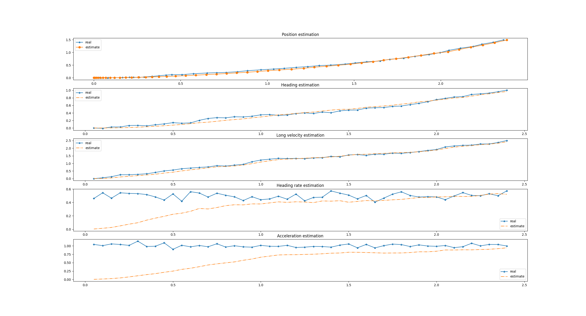

# A general unscented kalman filter
Written by Basel Alghanem at the University of Michigan ROAHM Lab and based on "The Unscented Kalman Filter for Nonlinear Estimation" by Wan, E. A., & Van Der Merwe, R. (2000). This python unscented kalman filter (UKF) implementation supports multiple measurement updates (even simultaneously) and allows you to easily plug in your model and measurements!

# Examples
Trying out the first example (example.py) should be really easy. It reads data from a provided csv and demonstrates the core functionality in a simple case. The system being modeled could be some kind of driving robot that has three sensors: an IMU measuring linear accelerations and angular velocities, a compass, and encoders measuring longitudinal velocity. The provided example trajectory runs at a constant longitudinal acceleration and yaw rate. The challenge of this example is tracking x and y position when they're not being directly measured. The dynamic model is described by the following:  
$$ X = \begin{bmatrix}|Pos_x|\\|Pos_y|\\Yaw \\Vel_{long}\\Vel_{yaw} \\Acc_{long}\\\end{bmatrix} = 
       \begin{bmatrix}x\\y\\\psi\\\upsilon\\\dot\psi\\\dot\upsilon\\\end{bmatrix}$$
where $$ \dot X = \begin{bmatrix}\upsilon\cos\psi\\\upsilon\sin\psi\\\dot\psi\\\dot\upsilon\\0\\0\end{bmatrix} $$

We introduced gaussian noise with the following covariance:  
$$ Q = 
\begin{bmatrix} 
0.0001&0&0&0&0&0\\
0&0.0001&0&0&0&0\\
0&0&0.0004&0&0&0\\
0&0&0&0.0025&0&0\\
0&0&0&0&0.0025&0\\
0&0&0&0&0&0.0025\\
\end{bmatrix}$$

From the compass and encoders, we're using the heading(0.02) and longitudinal velocity(0.001). From the IMU, we're using yaw rate (0.01) and longitudinal acceleration (0.03). We introduced gaussian noise for each sensor with these covariances: 
$$ R = 
\begin{bmatrix} 
0.01&0&0&0\\
0&0.03&0&0\\
0&0&0.02&0\\
0&0&0&0.0001\\
\end{bmatrix}$$

These exact covariances were input to the UKF, so the filter tracks quite well despite the process and measurement noise. Much of the challenge of using a UKF or any kalman filter is determining the covariances for real systems. Hopefully this library eases the programming burden!

## Usage
```bash
python3 example.py
```
## Result
